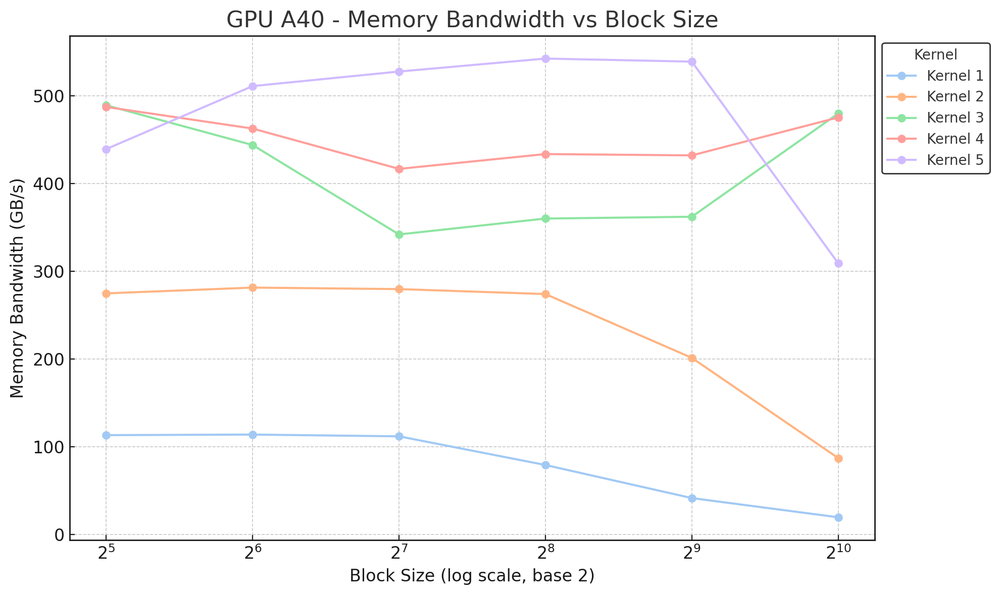

<!-- Header -->

# Kernels for LayerNorm forward pass

{{ #aipr_header }}

<!-- Main Body -->

## Introduction

The Layer Normalization (LayerNorm) operation applies normalization across the last D dimensions of the activation tensor as described in [this paper](https://arxiv.org/abs/1607.06450). The normalization equation is given below:

$$y = \frac{x - \mathbb{E}[x]}{\sqrt{\operatorname{Var}[x] + \epsilon}} * \gamma + \beta$$

This book outlines and provides a detailed explanation of a series of CUDA kernel implementations of LayerNorm forward pass based on the [llm.c](https://github.com/karpathy/llm.c/tree/master/dev/cuda) repository. Please refer to the [Layer Normalization book](../../../../fundamentals/src/normalizations/layernorm.md) for conceptual understanding and other details about the operation. For the purpose of this book, lets implement kernels for LayerNorm in the [Transformer](../../../../nlp/src/llms/architecture/transformer.md) architecture for language modeling which expects **a tensor of shape $(B, T, C)$ as input**, where $B$ is the batch size, $T$ is the sequence length and $C$ is the hidden dimension size. LayerNorm is applied to the last dimension.

The following table shows memory bandwidth for each kernel on a **A40 GPU for block size 512**. The last column shows improvement **over the first kernel**:

| Kernel # | Bandwidth (GB/s) | Improvement |
|:---------|-----------------:|:------------|
| 1 | 41.43 | - |
| 2 | 201.25 | 4.9x |
| 3 | 362.10 | 8.7x |
| 4 | 432.03 | 10.4x |
| 5 | 538.88 | 13x |


## Kernel 1

The first kernel is a copy of the CPU implementation. It parallelizes over the first 2 dimensions, $B$ and $T$, where $N = B*T$. **A single thread (see Figure-1) is responsible for normalizing one segment of size C**, hence it loops over all elements in that segment. The kernel code is broken down into 4 steps:
1. Mean calculation
$$\mathbb{E}[x] = \frac{1}{C} \sum_{i=1}^{C} x_i$$
2. Variance and reciprocal of standard deviation (rstd) calculation
$$\operatorname{Var}(x) = \frac{1}{C} \sum_{i=1}^{C} (x_i - \mathbb{E}[x])^2$$
$$rstd(x) = \frac{1}{\sqrt{\operatorname{Var}(x) + \epsilon}}$$
3. Apply mean and variance normalization and then scale and shift with the learnable weight and bias parameters
$$y_i = ((x_i - \mathbb{E}[x]) * rstd(x)) * \gamma_i + \beta_i$$
4. Store mean and rstd for backward pass

The kernel uses a 1D grid and block as shown in Figure-1. Also note that all operations are implemented in a single kernel.


<div
  class="figure-caption"
  style="text-align: center; font-size: 0.8em; margin-top: 10px;"
>
Figure-1: Kernel 1 Illustration.
</div>

```cpp
__global__ void layernorm_forward_kernel1(
    float* out, float* mean, float* rstd,
    const float* inp, const float* weight, const float* bias,
    int N, int C
) {
    int idx = blockIdx.x * blockDim.x + threadIdx.x;
    float eps = 1.0e-5f;

    if (idx < N) {
        // Go to the start index of the input segment for this thread, inp[idx, :]
        const float* x = inp + idx * C;
        
        // Compute mean
        float m = 0.0f;
        for (int i = 0; i < C; i++) {
            m += x[i];
        }
        m /= C;

        // Compute variance (without any bias correction)
        float v = 0.0f;
        for (int i = 0; i < C; i++) {
            float diff = x[i] - m;
            v += diff * diff;
        }
        v /= C;

        // Compute rstd
        float r = 1.0f / sqrt(v + eps);

        // Compute output
        // Go to the start index of the output segment for this thread, out[idx, :]
        float* y = out + idx * C;
        for (int i = 0; i < C; i++) {
            float o_prime = (x[i] - m) * r; // normalized output
            float o = o_prime * weight[i] + bias[i]; // scale and shift
            y[i] = o;
        }

        // Store mean and rstd for backward pass
        mean[idx] = m;
        rstd[idx] = r;
    }
}
```


## Kernel 2

In Kernel 2, steps 1, 2 and 3 are implemented as separate kernels. For the *mean* and *rstd* kernels, **each block is responsible for one segment of C** instead of each thread (see Figure-2) which allows for further parallelization. Whereas for the *normalization* kernel (step 3), each thread calculates one output element.

Since both the *mean* and *rstd* calculations involve the sum operation, they make use of *thread coarsening* and *reduction*. In *thread coarsening*, each thread sums corresponding elements and stores it in a *shared memory array* (same size as the thread block). In *reduction*, the elements in the *shared array* are iteratively reduced to obtain the final sum.

These optimizations lead to an improvement of **~5x over Kernel 1** (for block size 512). 


<div
  class="figure-caption"
  style="text-align: center; font-size: 0.8em; margin-top: 10px;"
>
Figure-2: Kernel 2 Illustration - mean and rstd kernels.
</div>

```cpp
__global__ void mean_kernel(
    float* mean,
    const float* inp,
    int N, int C,
    int block_size
) {
    extern __shared__ float shared[];
    int idx = blockIdx.x; // range [0, B*T)
    int tid = threadIdx.x; // range [0, block_size)
    const float* x = inp + idx * C;
    // thread coarsening
    float sum = 0.0f;
    for (int i = tid; i < C; i += block_size) {
        sum += x[i];
    }
    shared[tid] = sum;
    __syncthreads();
    // reductions
    for (int stride = block_size / 2; stride >= 1; stride /= 2) {
        __syncthreads();
        if (tid < stride) {
            shared[tid] += shared[tid + stride];
        }
    }
    // write the final result (at thread 0) to global memory
    if (tid == 0) {
        mean[idx] = shared[0] / C;
    }
}

__global__ void rstd_kernel(
    float* rstd,
    const float* inp, const float* mean,
    int N, int C,
    int block_size
) {
    extern __shared__ float shared[];
    int idx = blockIdx.x; // range [0, B*T)
    int tid = threadIdx.x; // range [0, block_size)
    const float* x = inp + idx * C;
    float m = mean[idx];
    // thread coarsening
    float sum = 0.0f;
    for (int i = tid; i < C; i += block_size) {
        float diff = x[i] - m;
        sum += diff * diff;
    }
    shared[tid] = sum;
    __syncthreads();
    // reductions
    for (int stride = block_size / 2; stride >= 1; stride /= 2) {
        __syncthreads();
        if (tid < stride) {
            shared[tid] += shared[tid + stride];
        }
    }
    // write the final result (at thread 0) to global memory
    if (tid == 0) {
        rstd[idx] = 1.0f / sqrtf(shared[0] / C + 1e-5f);
    }
}

__global__ void normalization_kernel(
    float* out,
    const float* inp, float* mean, float* rstd,
    const float* weight, const float* bias,
    int B, int T, int C
) {
    int idx = blockIdx.x * blockDim.x + threadIdx.x;

    int bt = idx / C;
    int c = idx % C;

    float m = mean[bt];
    float s = rstd[bt];
    float xi = inp[idx];
    float n = s * (xi - m);
    float o = n * weight[c] + bias[c];

    out[idx] = o;
}

void layernorm_forward2(
    float* out, float* mean, float* rstd,
    const float* inp, const float* weight, const float* bias,
    int B, int T, int C,
    const int block_size
) {
    int N = B * T;
    
    // in mean and rstd, threads cooperate within blocks via reductions
    mean_kernel<<<N, block_size, block_size * sizeof(float)>>>(mean, inp, N, C, block_size);
    cudaCheck(cudaGetLastError());
    rstd_kernel<<<N, block_size, block_size * sizeof(float)>>>(rstd, inp, mean, N, C, block_size);
    cudaCheck(cudaGetLastError());
    
    // in the normalization, everything just gets flattened out
    const int block_size2 = 256;  
    const int grid_size = ceil_div(B * T * C, block_size2);
    normalization_kernel<<<grid_size, block_size2>>>(out, inp, mean, rstd, weight, bias, B, T, C);
    cudaCheck(cudaGetLastError());
}
```

## Kernel 3

Kernel 3 introduces the use of *cooperative groups*, which allows us to utilize thread groups of arbitrary sizes (multiples of 2) and not limited to the thread block. The *cooperative groups* concept provides thread group classes (```tiled_partition<N>(g)```) with useful methods such as ```thread_rank()```, which returns the id of a the current thread in that group (similar to ```threadId.x```), and ```reduce()```, which performs a *reduction* operation (similar to that described in Figure-2) on the values assigned to variables for threads in that group. The *cooperative groups* objects are defined within the ```cooperative_groups``` namespace.

This kernel uses a thread group (or tile) size of 32 to align with the number of threads in a *warp* (lets refer to this thread group as a warp). Hence, **one warp is responsible for one segment of C** in Kernel 3 (see Figure-3 - A warp of size 4 is used for simplicity). Also note that all operations are again combined in a single kernel.

This kernel also includes a few additional changes:

1. Use of the [```__restrict__``` keyword](https://docs.nvidia.com/cuda/cuda-c-programming-guide/index.html#restrict): This allows the compiler to perform further optimizations through reduced memory accesses and computation
2. Use of [Cache Operators](https://docs.nvidia.com/cuda/parallel-thread-execution/index.html#cache-operators): ```__stcs()``` and ```__ldcs()``` limit cache pollution

These optimizations lead to an improvement of **~1.8x over Kernel 2** (for block size 512).


<div
  class="figure-caption"
  style="text-align: center; font-size: 0.8em; margin-top: 10px;"
>
Figure-3: Kernel 3 Illustration.
</div>

```cpp
__global__ void layernorm_forward_kernel3(
    float* __restrict__ out, float* __restrict__ mean, float* __restrict__ rstd,
    const float*  __restrict__ inp, const float*  __restrict__ weight, const float* __restrict__ bias,
    int N, int C
) {
    namespace cg = cooperative_groups;
    cg::thread_block block = cg::this_thread_block();
    cg::thread_block_tile<32> warp = cg::tiled_partition<32>(block);
    
    // meta_group_size is the number of warps in a block, and meta_group_rank is the warp index
    int idx = blockIdx.x * warp.meta_group_size() + warp.meta_group_rank();
    if(idx >= N) {
        return;
    }

    // the row of input that this group of threads is responsible for
    const float* x = inp + idx * C;

    // mean
    float sum = 0.0f;
    for (int i = warp.thread_rank(); i < C; i += warp.size()) {
        sum += x[i];
    }
    sum = cg::reduce(warp, sum, cg::plus<float>{});
    float m = sum / C;
    if(warp.thread_rank() == 0 && mean != nullptr) {
        __stcs(mean + idx, m);
    }

    // rstd
    sum = 0.0f;
    for (int i = warp.thread_rank(); i < C; i += warp.size()) {
        float diff = x[i] - m;
        sum += diff * diff;
    }
    sum = cg::reduce(warp, sum, cg::plus<float>{});
    float s = rsqrtf(sum / C + 1e-5f);
    if(warp.thread_rank() == 0 && rstd != nullptr) {
        __stcs(rstd + idx, s);
    }

    // final normalization and scaling by weight/bias
    float* o = out + idx * C;
    for (int c = warp.thread_rank(); c < C; c += warp.size()) {
    // load and store using the .cs "streaming" hint to the compiler,
    // indicating that this data will not be reused soon, and can be streamed through the caches
    // this allows the threads to get more cache-hits for the (shared) weight and bias parameters
        float n = s * (__ldcs(x+c) - m);
        __stcs(o+c, n * weight[c] + bias[c]);
    }
}
```


## Kernel 4

This kernel is similar to Kernel 3, except for the formula used to calculate variance. The variance is calculated as follows, leading to fewer subtraction operations:

$$\operatorname{Var}(x) = \mathbb{E}[x^2] - (\mathbb{E}[x])^2$$

This simple change also leads to a small improvement of **~1.2x over Kernel 3** (for block size 512).

## Kernel 5

The final kernel operates in two stages. Similar to Kernel 2, **each block is responsible for one segment of C**. In stage 1, even though *thread coarsening* is done on the block level, the first *reduction* is done on the warp level. This sum is written into a *shared memory array* whose size is equal to the number of warps. In stage 2, the threads in the first warp are re-used to perform another *warp reduction* on the *shared array* to obtain the final sum. There is no *thread coarsening* for this stage. See Figure-4 for the complete flow.

The final kernel improves by **~1.25x over Kernel 4** and **~13x over the first kernel** (for block size 512).


<div
  class="figure-caption"
  style="text-align: center; font-size: 0.8em; margin-top: 10px;"
>
Figure-4: Kernel 5 Illustration.
</div>

```cpp
__global__ void layernorm_forward_kernel5(
    float* __restrict__ out, float* __restrict__ mean, float* __restrict__ rstd,
    const float*  __restrict__ inp, const float*  __restrict__ weight, const float* __restrict__ bias,
    int N, int C
) {
    namespace cg = cooperative_groups;
    cg::thread_block block = cg::this_thread_block();
    cg::thread_block_tile<32> warp = cg::tiled_partition<32>(block);

    __shared__ float shared_sum[32]; // block_size max is 1024 = 32 * 32 warps
    __shared__ float shared_sum2[32]; // warps will be writing into shared memeory after warp-reduce

    int num_warps = blockDim.x / 32;
    int warp_id = threadIdx.x / 32;
    int lane_id = threadIdx.x % 32;
    int idx = blockIdx.x; // simply one block per row

    // the row of input that this group of threads is responsible for
    const float* x = inp + idx * C;

    // Stage 1
    // thread coarsening through the row, reduce the sum in series
    float thread_sum = 0.0; // stores sum(x)
    float thread_sum2 = 0.0; // stores sum(x**2)
    // for (int i = C + threadIdx.x - blockDim.x; i >= 0; i -= blockDim.x) {
    for (int i = threadIdx.x; i < C; i += blockDim.x) {
        float xi = x[i];
        thread_sum += xi;
        thread_sum2 += xi * xi;
    }
    // warp-level reduction
    float warp_sum = cg::reduce(warp, thread_sum, cg::plus<float>{}); // sum(x)
    float warp_sum2 = cg::reduce(warp, thread_sum2, cg::plus<float>{}); // sum(x**2)
    // store the warp-level reduction in shared memory (we could have lane_id == 0 guard but not needed)
    shared_sum[warp_id] = warp_sum;
    shared_sum2[warp_id] = warp_sum2;
    __syncthreads();

    // Stage 2
    // load results from shared memory to threads, pad with zeros for threads that are out of bounds
    warp_sum = (lane_id < num_warps) ? shared_sum[lane_id] : 0.0f;
    warp_sum2 = (lane_id < num_warps) ? shared_sum2[lane_id] : 0.0f;
    // now reduce the warp-level reductions
    float block_sum = cg::reduce(warp, warp_sum, cg::plus<float>{}); // sum(x)
    float block_sum2 = cg::reduce(warp, warp_sum2, cg::plus<float>{}); // sum(x**2)

    // mean, var, rstd
    block_sum /= C; // mean(x)
    block_sum2 /= C; // mean(x**2)
    float m = block_sum;
    float var = block_sum2 - m * m;
    float s = rsqrtf(var + 1e-5f);
    // store the mean, no need to cache it
    if(threadIdx.x == 0 && mean != nullptr) {
        __stcs(mean + idx, m);
    }
    // store the rstd, no need to cache it
    if(threadIdx.x == 0 && rstd != nullptr) {
        __stcs(rstd + idx, s);
    }

    // final normalization and scaling by weight/bias
    float* o = out + idx * C;
    for (int i = threadIdx.x; i < C; i += blockDim.x) {
        float n = s * (__ldcs(x+i) - m);
        __stcs(o+i, n * weight[i] + bias[i]);
    }
}
```

## Summary

The following figure provides a summary of the memory bandwidth for all kernels on a A40 GPU across different block sizes:



<div
  class="figure-caption"
  style="text-align: center; font-size: 0.8em; margin-top: 10px;"
>
Figure-5: A40 Memory Bandwidth Summary.
</div>


<!-- Contributors -->

{{#author xeon27}}
