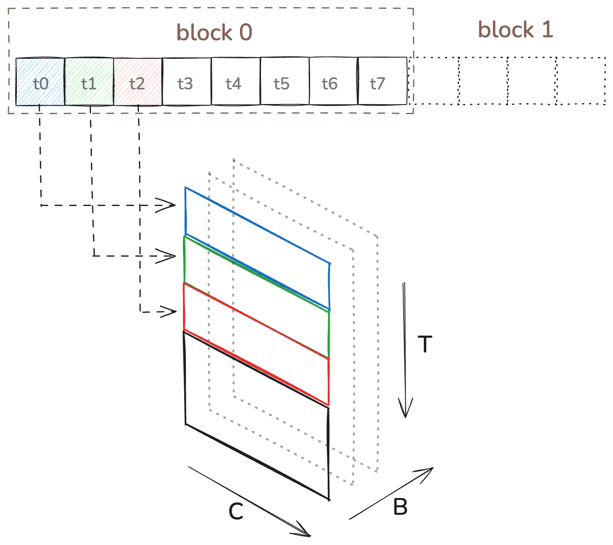
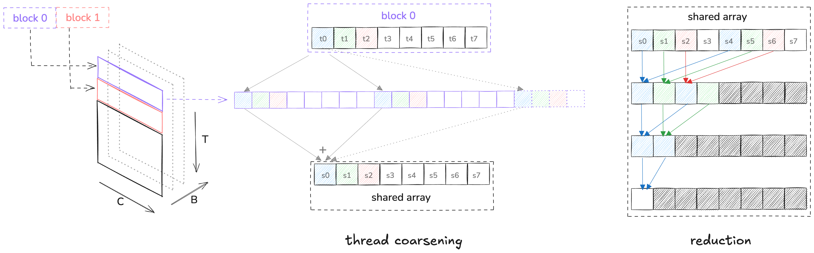
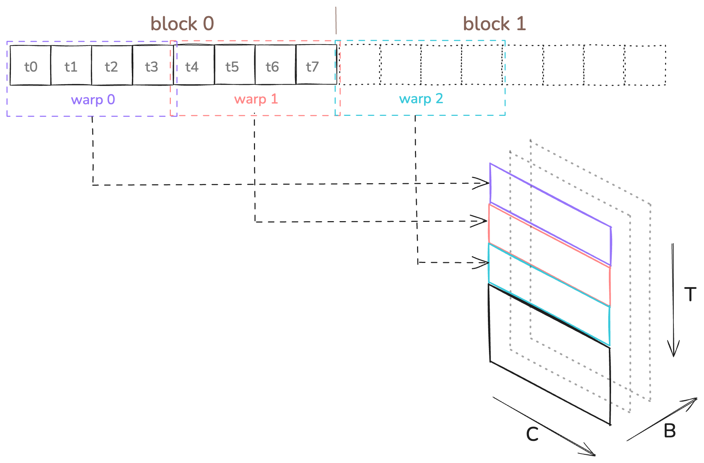
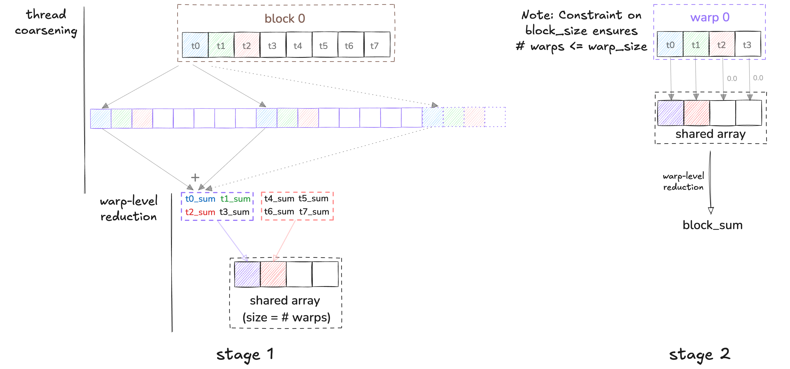

<!-- Header -->

# Kernels for layernorm forward pass

{{ #aipr_header }}

<!-- Main Body -->

## Introduction

## Kernel 1



<div
  class="figure-caption"
  style="text-align: center; font-size: 0.8em; margin-top: 10px;"
>
Figure: Kernel 1 Illustration.
</div>

```cpp
__global__ void layernorm_forward_kernel1(
    float* out, float* mean, float* rstd,
    const float* inp, const float* weight, const float* bias,
    int N, int C
) {
    int idx = blockIdx.x * blockDim.x + threadIdx.x;
    float eps = 1.0e-5f;

    if (idx < N) {
        // Go to the start index of the input segment for this thread, inp[idx, :]
        const float* x = inp + idx * C;
        
        // Compute mean
        float m = 0.0f;
        for (int i = 0; i < C; i++) {
            m += x[i];
        }
        m /= C;

        // Compute variance (without any bias correction)
        float v = 0.0f;
        for (int i = 0; i < C; i++) {
            float diff = x[i] - m;
            v += diff * diff;
        }
        v /= C;

        // Compute rstd
        float r = 1.0f / sqrt(v + eps);

        // Compute output
        // Go to the start index of the output segment for this thread, out[idx, :]
        float* y = out + idx * C;
        for (int i = 0; i < C; i++) {
            float o_prime = (x[i] - m) * r; // normalized output
            float o = o_prime * weight[i] + bias[i]; // scale and shift
            y[i] = o;
        }

        // Store mean and rstd for backward pass
        mean[idx] = m;
        rstd[idx] = r;
    }
}
```


## Kernel 2



<div
  class="figure-caption"
  style="text-align: center; font-size: 0.8em; margin-top: 10px;"
>
Figure: Kernel 2 Illustration - mean and rstd kernels.
</div>


## Kernel 3



<div
  class="figure-caption"
  style="text-align: center; font-size: 0.8em; margin-top: 10px;"
>
Figure: Kernel 3 Illustration.
</div>


## Kernel 4

## Kernel 5



<div
  class="figure-caption"
  style="text-align: center; font-size: 0.8em; margin-top: 10px;"
>
Figure: Kernel 5 Illustration.
</div>


<!-- Contributors -->

{{#author xeon27}}
