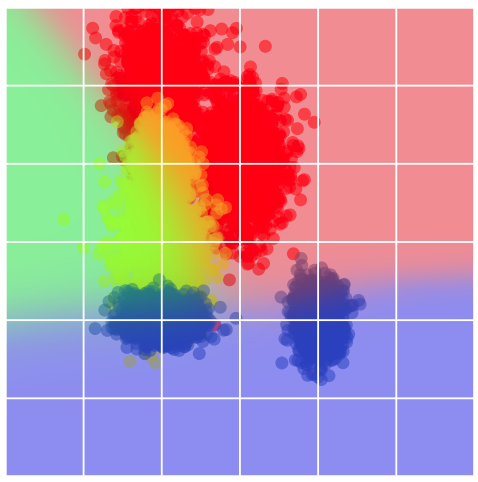
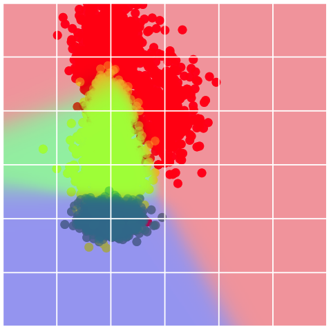
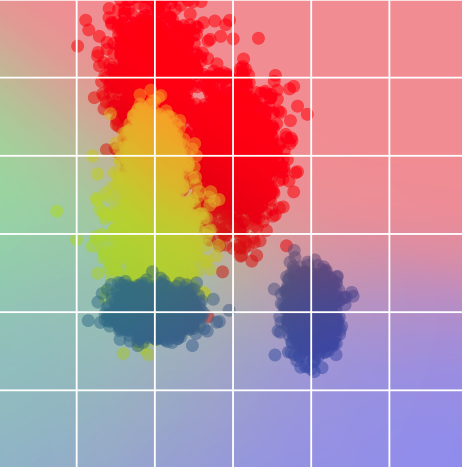
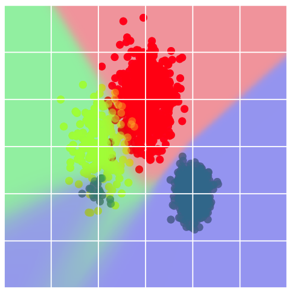

<!-- markdownlint-disable-file MD033 MD013 -->

# Robust Global FL Approaches

{{ #aipr_header }}

## Data heterogeneity in standard ML

In standard ML, when training and deploying a model, a standard underlying
assumption is that the training data is distributionally
similar to new data to which the model will be applied. There are methods
that specialize in out-of-domain generalization, but in most cases
models are assumed to be applied on data that is drawn from the same
statistical distributions that describe the data on which it was trained. The
validity of this assumption can degrade, for example, over time or due to
the model being used to make predictions in entirely new domains.

While data shifts present a significant challenge in centralized ML training,
the characteristics that describe data shifts in this domain also exist in FL
when comparing disparate, distributed datasets. Data shift between such
datasets is typically referred to as "data heterogeneity" between clients. Such
heterogeneity introduces new obstacles in FL and is quite prevalent. Before
discussing its impact on federated training and how it is addressed. Let's
define some types of data divergence. Three common ways to describe
disparities or shifts between training and inference data are:[^1]

1. [Label Shift](#label-shift)
2. [Covariate Shift](#covariate-shift)
3. [Concept Drift](#concept-drift)

Let \\(X\\) and \\(Y\\) represent the feature (input) and label (output)
spaces, respectively for a model. Shifts are present, regardless of whether
model performance degrades, when the joint distributions

$$
\begin{align}
P\_{\\text{train}}(X, Y) \\neq P\_{\\text{test}}(X, Y). \tag{1}
\end{align}
$$

### Label Shift

Label shifts occur when there is a change in the label distribution \\(\\mathbb{P}(Y)\\)
with a fixed posterior distribution \\(\\mathbb{P}(X \\vert Y)\\). That is, the
probability of seeing different label values shifts, but the distribution of
features conditioned on the labels does not change. A pertinent example of
this might be data meant to train a model to diagnose COVID-19 in the early
days of spread versus the later stages when the virus was widely circulating.
Generally, the symptoms, given that someone had the virus, did not markedly
change. However, the prevalence of the virus, \\(\\mathbb{P}(Y)\\), did.

### Covariate Shift

Covariate shifts between data distributions represent a change in the feature
distribution, \\(\\mathbb{P}(X)\\), while the statistical relationship of labels to
features, \\(\\mathbb{P}(Y \\vert X)\\), remains fixed. Consider the setting of training
a readmission risk model on data drawn from the patient population of a
general hospital. If, for instance, that model were transferred for use at a
nearby pediatric hospital. Assuming all else equal, predictions from that model
would be influenced by covariate drift due to the change in patient
demographics. Namely, though features associated with younger patients are
likely part of the general hospital population, they will, of course, be
statistically over-represented in the data points seen by the model at the
pediatric hospital.

### Concept Drift

Concept drift is characterized by a change in \\(\\mathbb{P}(Y \vert X)\\) provided a
fixed \\(\\mathbb{P}(Y)\\). Essentially, this drift encapsulates a shift in the
predictive relationship between the features, \\(X\\), and the labels, \\(Y\\).
As an illustrative example, consider training a purchase conversion model
for airline ticket purchases where two possible incentives are features. The
first offers a ticket discount to encourage purchase, whereas the second offers
free add-ons. In good economic periods, the second incentive may produce higher
conversion rates. On the other hand, in periods of economic uncertainty,
perhaps the first offer would do so.

Note that each of the shifts discussed above may exist in isolation or be
present together to varying degrees.

## How does data heterogeneity manifest in FL?

In FL, differences in training data distributions are not strictly temporal or
marked by a change in the joint probability distributions of the training and
test datasets, as expressed in Equation (1). Each client participating in
federated training might naturally exhibit distribution disparities compared
to one another. Consider the example given in the Section on
[Covariate Shift](#covariate-shift). If the general and pediatric hospitals
would like to collaboratively train a model using FL, the demographics of
their patient populations mean that there will be substantial statistical
heterogeneity between their respective training datasets.

Each distributed training dataset in an FL system may naturally exhibit the
various disparities, compared with one another, discussed above. As a further
example, consider two financial institutions working together to train a fraud
detection model. Because of their different clientele, one bank may experience
fraud at a rate of 2% per transaction, while the other may see only 0.1%, an
example of label shift, among potentially others.

## How does it impact FL models and their training?

Data heterogeneity, in its various forms, has been linked to a number of
challenges in training FL models using methods like
[FedAvg](../vanilla_fl/fedavg.md), including slower convergence, performance
degradation, and unevenly distributed training dynamics among clients. In [2],
a clear illustration of the impact of data heterogeneity is provided. In the
figures below, two clients have locally trained a model on their respective
datasets.

<figure>

<figcaption>Two clients with different datasets. Note that each holds a
slightly different view of the feature space. Notably, Client 1 (left) has a
distinct cluster of data points in the bottom right and fewer points labeled in
green within the red cluster. </figcaption>

</figure>

The decision boundaries of the locally trained models are largely similar but
differ in important ways. If the two models are averaged via FedAvg (see figure
below), the result is a blurred decision boundary which has diverged from the
sharp boundary one would expect to compute were the data agglomerated and a
central model trained. Alternatively, using an approach that is more robust
to data heterogeneity, FedDF,[^2] the resulting model exhibits the kinds of
classification boundaries one would expect when considering the data
distributions from a global perspective.

<figure>

<figcaption>Model resulting from FedAvg (left) compared with the model
trained using FedDF (right).</figcaption>

</figure>

There are two common routes, among many other routes, for addressing
heterogeneity in FL. The first is to maintain a sense of a single global model
to be trained by all participants. Modifications to items like the aggregation
strategy, local learning objectives, or corrections to model updates are
applied to better align FL training with the dynamics of centralized training
without sacrificing most of the benefits associated with the original FedAvg
algorithm. The second route is to abandon, to one degree or another, the idea
of a global model that performs well across all clients and instead allow
each client to train a unique model. This is known as Personal or Personalized
FL (pFL). Such models still benefit from global information through aspects of
FL, but more strongly emphasize local distributions.

<figure>

<figcaption>Two possible routes for addressing data heterogeneity in FL.</figcaption>

</figure>

In the subsequent sections of this chapter, we'll cover a few of the many FL
methods aimed at robust global model optimization in FL. Such models are often
more generalizable and are more easily distributed to new domains than their
pFL equivalents. Alternatively, model performance on each client may not be
as high as those produced by pFL approaches.

#### References & Useful Links <!-- markdownlint-disable-line MD001 -->

[^1]:
    J. Quinonero-Candela, M. Sugiyama, A. Schwaighofer, and N. D. Lawrence. Dataset shift
    in machine learning. Mit Press, 2008

[^2]:
    [Lin, Tao et al. “Ensemble distillation for robust model fusion in federated
    learning”. In: Proceedings of the 34th International Conference on Neural
    Information Processing Systems. NIPS ’20. Vancouver, BC, Canada: Curran
    Associates Inc., 2020.](https://proceedings.neurips.cc/paper/2020/file/18df51b97ccd68128e994804f3eccc87-Paper.pdf)

{{#author emersodb}}
