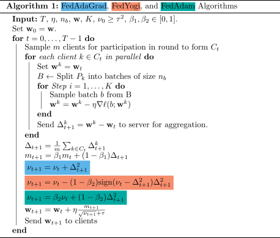

<!-- markdownlint-disable-file MD033 MD013 -->

# The FedOpt Family of Aggregation Strategies

{{ #aipr_header }}

Recall that modern deep learning optimizers like AdamW[^1] or AdaGrad[^2] use
first- and second-order moment estimates of the stochastic gradients computed
during iterative optimization to adaptively modify the model updates.
At a high level, each algorithm aims to reinforce common update directions
(i.e. those with momentum) and damp update noisy directions (i.e. those with
high batch-to-batch variance). The FedOpt family[^3] of algorithms, considers
modifying the traditional FedAvg aggregation algorithm to incorporate similar
adaptations into server-side model updates in FL.

## Mathematical motivation

In [FedAvg](../vanilla_fl/fedavg.md), recall that, after a round of local
training on each client, client model weights are combined into a single model
representation via

$$
\begin{align*}
\\mathbf{w}\_{t+1} = \\sum\_{k \\in C_t} \\frac{n_k}{n_s} \\mathbf{w}^k_{t+1},
\end{align*}
$$

where \\(\\mathbf{w}^k\_{t+1}\\) is simply the model weights after local
training on client \\(k\\). For round \\(t\\), each client starts local
training from the same set of weights, \\(\\mathbf{w_t}\\). Assume that each
client has the same number of data points such that \\(n_k = m\\). With a bit
of algebra, the update is rewritten

$$
\begin{align}
\\mathbf{w}\_{t+1} = \\sum\_{k \\in C_t} \\frac{n_k}{n_s} \\mathbf{w}^k\_{t+1} &= \\mathbf{w}_t - \\frac{1}{C_t} \\sum\_{k \\in C_t}
\\left( \\mathbf{w}_t - \\mathbf{w}^k\_{t+1} \\right), \\\\
&= \\mathbf{w}_t - \\frac{1}{C\_t} \\sum\_{k \\in C_t}  \\Delta^k\_{t+1}, \\\\
&= \\mathbf{w}_t - \\Delta\_{t+1}. \tag{1}
\end{align}
$$

Here, \\(\\Delta^k\_{t+1} = \\mathbf{w}\_t - \\mathbf{w}^k\_{t+1}\\) is just
the vector pointing from the initial models weights and to those after local
training and \\(\\Delta\_{t+1}\\) is simply the uniform average of these
update vectors.

Recall that, if each client uses a fixed learning rate, \\(\eta\\), and
performs a single, full gradient update, FedAvg is equivalent to centralized
large-batch SGD. Similarly, in this case, if each client performs on step of
batch SGD with a learning rate of 1.0, then the update in Equation (1) is
equivalent to a batch-SGD update with a learning rate of 1.0 for the
**server**. The "server-side" batch is the union of the batches used on each
client.

The observation that \\(\Delta\_{t+1}\\) is simply a stochastic gradient
motivates treating these update directions,
\\(\\Delta^k\_{t+1} = \\mathbf{w}\_t - \\mathbf{w}^k\_{t+1}\\) like the
stochastic gradients in standard adaptive optimizers. It's important to note
that if the clients, for instance, apply multiple steps of local SGD or use
different learning rates, the exact equivalence of \\(\Delta\_{t+1}\\) to a
stochastic gradient is broken. However, it shares similarities to such a
gradient and is, therefore, called a "pseudo-gradient."[^3]

## The algorithms: FedAdagrad, FedAdam, FedYogi

Drawing inspiration from three successful, traditional adaptive optimizers,
adaptive server-side aggregation strategy FedAdaGrad, FedAdam, and FedYogi have
been proposed. See the algorithm below for details.

<figure>

</figure>

Those familiar with the mathematical formulations of Adagrad, Adam[^4], and
Yogi[^5] will recognize the general structure of these equations. Computation
of \\(m_t\\), based on the average of the update directions suggested by each
client through local training (\\(\Delta\_{t+1}\\)) serves to accumulate
momentum associated with directions that are consistently and frequently part
of these updates. On the other hand, \\(\nu_t\\) estimates the variance
associated with update directions throughout the server rounds. Directions
with higher variance values are damped in favor of those with more consistency
round over round.

As with the usual forms of these algorithms, there are a number of
hyper-parameters that can be tuned, including \\(\tau, \beta_1,\\) and
\\(\beta_2\\). However, sensible defaults are suggested in the paper such that
\\(\beta_1=0.9\\) and \\(\beta_2=0.99\\). The authors also show that
performance is generally robust to \\(\tau\\).

A number of experiments show that the proposed FedOpt family of algorithms
can outperform FedAvg, especially in heterogeneous settings. Moreover, these
algorithms, in the experiments of the paper, outperform SCAFFOLD,[^6] a
variance reduction method aimed at improving convergence in the presence of
heterogeneity. A final advantage of the FedOpt family of algorithms is that
they are accompanied by several convergence results showing that, as long as
the variance of the local gradients is not too large, the algorithms converge
properly.

#### References & Useful Links <!-- markdownlint-disable-line MD001 -->

[^1]:
    [I. Loshchilov and F. Hutter. Fixing weight decay regularization in ADAM,
    2018.386](https://arxiv.org/pdf/1711.05101)

[^2]:
    [Duchi, J., Hazan, E., & Singer, Y. (2011). Adaptive subgradient methods
    for online learning and stochastic optimization. Journal of machine learning research, 12(7).](https://www.jmlr.org/papers/volume12/duchi11a/duchi11a.pdf)

[^3]:
    [S. J. Reddi, Z. Charles, M. Zaheer, Z. Garrett, K. Rush, J. Konêcný, S. Kumar, and H. B.
    McMahan. Adaptive federated optimization. In ICLR 2021, 2021.](https://arxiv.org/abs/2003.002950)

[^4]:
    [Kingma, D. P. & Ba, J. (2015). Adam: A Method for Stochastic Optimization.
    In Y. Bengio & Y. LeCun (eds.), ICLR (Poster).](https://arxiv.org/pdf/1412.6980)

[^5]:
    [Manzil Zaheer, Sashank J. Reddi, Devendra Sachan, Satyen Kale, and
    Sanjiv Kumar. 2018. Adaptive methods for nonconvex optimization. In Proceedings of the 32nd International Conference on Neural Information Processing Systems (NIPS'18). Curran Associates Inc., Red Hook, NY, USA, 9815–9825.](https://proceedings.neurips.cc/paper_files/paper/2018/file/90365351ccc7437a1309dc64e4db32a3-Paper.pdf)

[^6]:
    [S. P. Karimireddy, S. Kale, M. Mohri, S. Reddi, S. Stich, and A. T. Suresh.
    SCAFFOLD: Stochastic controlled averaging for federated learning. In
    Hal Daumé III and Aarti Singh, editors, Proceedings of the 37th
    International Conference on Machine Learning, volume 119 of Proceedings of
    Machine Learning Research, pages 5132–5143. PMLR, 13–18 Jul 2020.](https://www.microsoft.com/en-us/research/publication/frustratingly-easy-neural-domain-adaptation/)

{{#author emersodb}}
