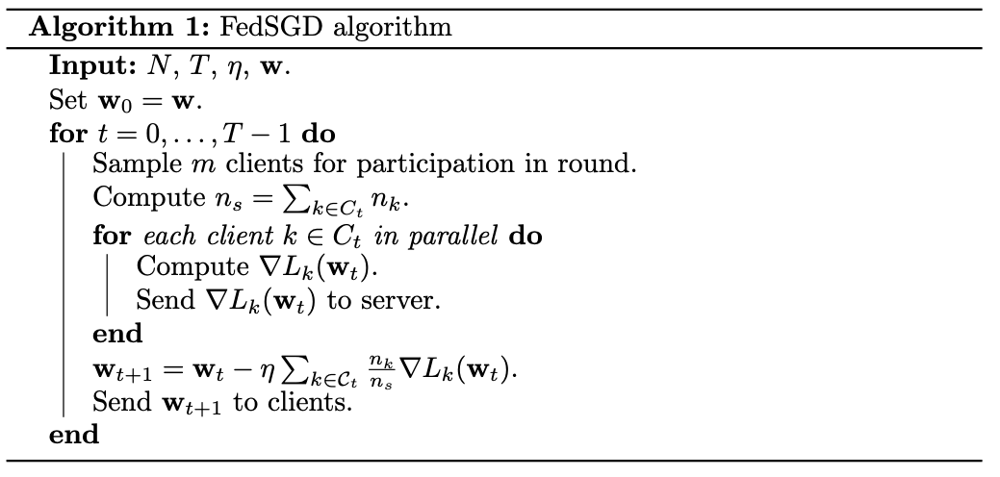

<!-- markdownlint-disable-file MD033 MD013 -->

# FedSGD

{{ #aipr_header }}

Given the Horizontal FL setup, the general idea of FedSGD[^1] is fairly
straightforward.

1. During each server round, participating clients compute a gradient based on
   their local loss function, using the current model weights, \\(\\mathbf{w}\\),
   applied to their local dataset. These gradients are sent to the server.
2. The server uses the client gradients to update the weights of a model.
3. The server sends the updated model weights back to the clients, who proceed
   to compute a new gradient based on their data.

## The math

Leveraging the notation set out in the previous section
([Foundational FL Techniques](index.md)), denote by \\(P_k\\) the indices
of samples from client \\(k\\) in the total dataset \\(D\\), and denote
\\(n_k = \\vert P_k \\vert\\). Then we can write the loss over the entire
dataset as

$$
\begin{align*}
\\ell(\\mathbf{w}) = \\frac{1}{n} \\sum\_{k=1}^{N} \\sum\_{i \\in P\_k} \\ell\_i(\\mathbf{w}),
\end{align*}
$$

recalling that \\(\\ell_i(\\mathbf{w})\\) is the loss function with respect
to the \\(i^{\\text{th}}\\) sample. In this equation it is the
\\(i^{\\text{th}}\\) sample drawn from the dataset \\(D_k\\).

For a server round \\(t\\) and current set of model weights, \\(\\mathbf{w}\_t\\),
consider selected a subset, \\(C_t\\), of \\(m \\leq N\\) clients from which to
compute a weight update. The loss over all data points held by the clients in
\\(C_t\\) is written

$$
\begin{align*}
\\ell_t(\\mathbf{w}\_t) = \\frac{1}{n\_s} \\sum\_{k \\in C\_t} \\sum\_{i \\in P_k} \\ell\_i(\\mathbf{w}\_t),
\end{align*}
$$

where \\(n_s = \\displaystyle{\\sum\_{k \\in C_t} n_k}\\). For a given client
\\(k\\), define

$$
\begin{align*}
L\_k(\\mathbf{w_t}) = \\frac{1}{n_k} \\sum\_{i \\in P_k} \\ell\_i(\\mathbf{w_t}).
\end{align*}
$$

Note that \\(L_k(\\mathbf{w}\_t)\\) is simply the local loss for client \\(k\\) across all
data points in its dataset, \\(D_k\\). Then

$$
\begin{align*}
\\ell_t(\\mathbf{w}\_t) = \\sum\_{k \\in C_t} \\frac{n_k}{n_s} L_k(\\mathbf{w}_t).
\end{align*}
$$

Observe that the global loss, \\(\\ell_t(\\mathbf{w}\_t)\\), over the selected
subset of clients, \\(C_t\\), is now written as a linearly weighted combination
of the local losses of each client.

As the gradient is a linear operator, the gradient of the global loss is

$$
\begin{align*}
\\nabla \\ell_t(\\mathbf{w}\_t) = \\sum\_{k \\in C_t} \\frac{n_k}{n_s} \nabla L_k(\\mathbf{w}_t).
\end{align*}
$$

This implies that model weights \\(\mathbf{w}\_t\\) are updated as

$$
\begin{align}
\\mathbf{w}\_{t+1} = \\mathbf{w}\_t - \\eta \\sum\_{k \in C_t} \\frac{n\_k}{n\_s} \\nabla L\_k(\\mathbf{w}\_t), \tag{1}
\end{align}
$$

for some learning rate \\(\\eta > 0\\). Because \\(\\nabla L_k(\\mathbf{w}\_t)\\)
is the gradient of the local loss function of client \\(k\\), this update is
simply a linearly weighted combination of **local** gradients, which can be
computed locally by each client.

### FedSGD is just Large Batch SGD

One of the important properties of FedSGD is that the update in Equation (1) is
mathematically equivalent to

$$
\begin{align*}
\\mathbf{w}\_{t+1} = \\mathbf{w}\_t - \\eta \\nabla \\ell_t(\\mathbf{w}\_t),
\end{align*}
$$

where \\(\\ell_t\\) denotes the loss function over all data in each of the
clients in \\(C_t\\). As such, FedSGD, in spite of leveraging gradients
computed in a distributed fashion on each individual client, is equivalent to
performing centralized batch SGD, where the batch is of size
\\(n_s = \\displaystyle{\\sum\_{k \\in C_t} n_k}\\).

Among other implications, this means that convergence theory associated with
standard batch SGD is directly applicable to the FedSGD procedure.

## The algorithm

We are now in a position to fill in the details of the general Horizontal FL algorithm
presented in [Horizontal Federated Learning](../index.md). The full workflow
of FedSGD is summarized in the algorithm below. Inputs are \\(N\\),
the number of clients, \\(T\\), the number of server rounds to perform,
\\(\\eta\\) the learning rate, and \\(\\mathbf{w}\\), the initial weights for
the model to be trained. After the final server round is complete, each
client receives the final model as described by the weights \\(\mathbf{w}\_T\\).

<figure>

</figure>

### Communication overhead

The FedSGD algorithm has several benefits, including the mathematical
equivalence discussed above. However, it has at least one significant drawback.
Communication between the clients and server occurs for every SGD step. That
is, for each model update, participating clients are required to communicate their
gradients, and the server must send updated model weights back. In most settings,
latency associated with communication between clients and servers will be
significantly higher than that of computing the local gradients or performing
the weight updates. As such communication overhead become a significant
bottleneck and materially slows training. Reducing communication costs is the
driving motivation behind the FedAvg approach.

#### References & Useful Links

[^1]:
    [H. B. McMahan, E. Moore, D. Ramage, S. Hampson, and B. A. y Arcas.
    Communication-efficient learning of deep networks from decentralized data.
    Proceedings of the 20th AISTATS, 2017.](https://proceedings.mlr.press/v54/mcmahan17a/mcmahan17a.pdf)

{{#author emersodb}}
